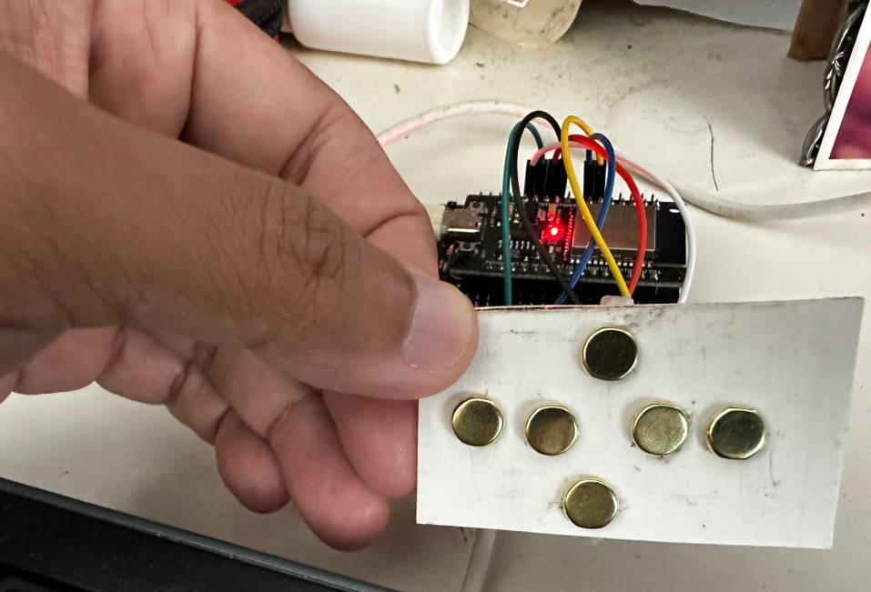

# KodiRemote - A simple remote controller for Kodi on an ESP32



This sketch uses the touch pins of an ESP32 to make a remote controller for a
[Kodi](https://kodi.tv) media center. As you can see in the picture above, the
GPIO pins 32, 33, 27, 14, 12 and 13 are connected to a bunch of thumb tacks.


## Requirements

The most important requirement is the *Arduino CLI* tool or *Arduino IDE*.
Personally I don't like GUIs for programming and I tend to use `arduino-cli`.
This sketch has been tested on *Ubuntu 24.04*.

The following libraries are required:
- WiFi (Already part of the main Arduino library)
- HTTPClient (Already part of the main Arduino library)
- [ArduinoJson](https://arduinojson.org/) library.


## Compile

Compiling is a simple matter of running `make`. The makefile will automatically
execute the `secrets` bash script which will prompt you for your WiFi SSID,
WiFi Password, ESP32 hostname and Kodi hostname (or IP address).

If you are running windows, you may need to manually create the `Secrets.h`
file. The format is very simple, like so:

```cpp
#define WIFI_HOSTNAME "esp32hostname"
#define WIFI_SSID "MyWiFiSSID"
#define WIFI_PASSWORD "**********"
#define JSONRPC_URL "http://kodihost:8080/jsonrpc"
```
